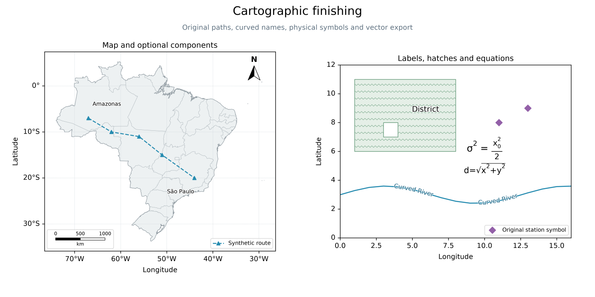
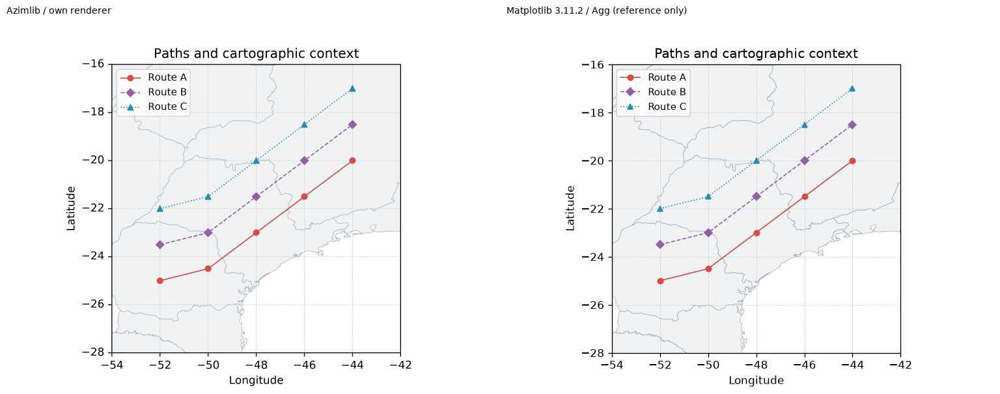

# Galeria de acabamento 0.3.0 development

Composição original gerada por [finishing_atlas.py](../../../examples/finishing_atlas.py)
com Azimlib; símbolos, polígonos e valores temáticos são sintéticos/originais
sob BSD-3-Clause. O contexto brasileiro usa Natural Earth, domínio público;
fontes DejaVu conservam os avisos incorporados. Nenhuma imagem de referência,
ícone ou implementação foi copiada.

A comparação separada usa dados/rotas próprios iguais e formatter numérico
explícito nas duas bibliotecas. Matplotlib é dependência de desenvolvimento
apenas do [gerador](../../../tools/compare_finishing.py), nunca do runtime.
Os PNGs são resultados de composição original; a referência externa e sua
versão são identificadas no manifest. Não representa identidade pixel a pixel.

Veja [contratos e limitações](../../finishing.md) e [manifest](manifest.json).
PDF usa contornos vetoriais, sem texto pesquisável neste corte. SVG mantém
texto editável; PNG tem antialiasing próprio. Relatórios são locais Windows,
não uma nova CI remota ou aceite visual humano de outras plataformas.
