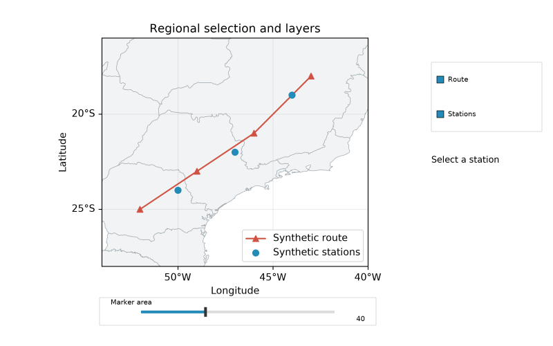
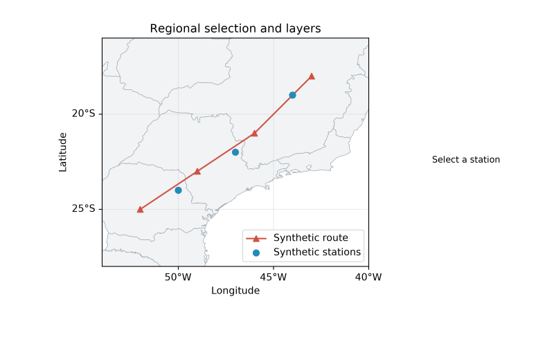

# Interação regional 0.3.0 development

Composição original de [interactive_layers.py](../../../examples/interactive_layers.py),
com rotas/estações sintéticas e controles opcionais. Geografia Natural Earth em
domínio público; DejaVu preserva sua própria licença. O [manifest](manifest.json)
identifica os bytes e o gerador. Nenhum asset de outro viewer foi copiado.

`savefig()` não incorpora controles de interação:

Consulte o [guia](../../interaction.md) para instalar extras, picking, sliders,
seleção, limites de reprojeção, notebook e lifecycle. Estas imagens foram geradas
pelo renderer próprio e inspecionadas localmente; não são aceite visual humano de
Linux/macOS nem do navegador vivo.
