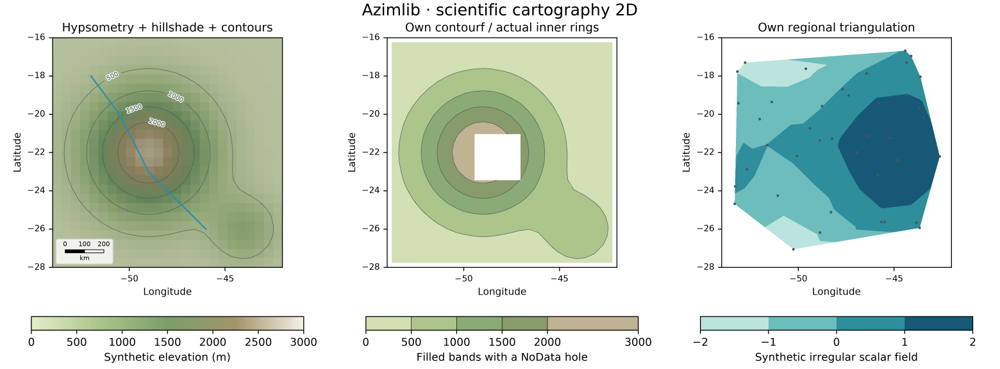
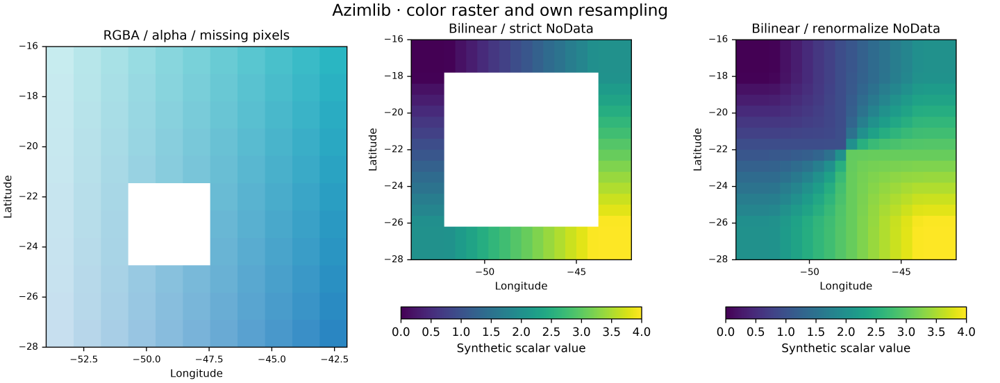
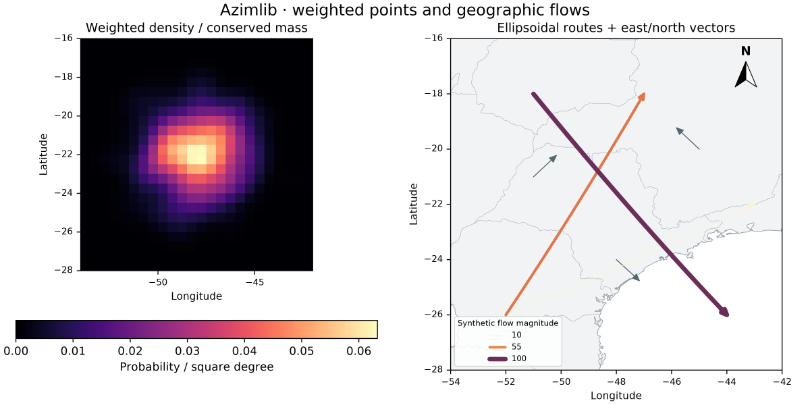

# Scientific 2D gallery

Generated by [scientific_atlas.py](../../../examples/scientific_atlas.py) using
the installed Azimlib renderer. Synthetic terrain, pixels, weighted samples,
triangulation nodes and flows are original fixtures, BSD-3-Clause,
Copyright (c) 2026 Kernerian. Background boundaries in the flow map are
Natural Earth public domain; colormap/font notices remain in the project.
See [contracts](../../scientific-2d.md) and [manifest](manifest.json).

PNG/SVG/HTML are exported locally; PNG previews are versioned here. Neither
HTML navigation nor an orthographic globe is a true 3D terrain camera.
