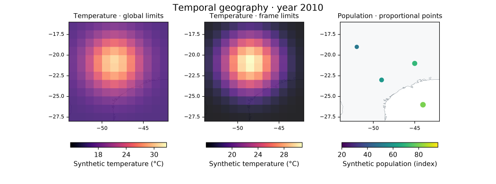

# Original temporal geography and regional atlas



[Synthetic climate animation](climate.gif), [own regional multi-page PDF](regions.pdf),
[SVG map composition](temporal-atlas.svg) and [manifest](manifest.json).
Individual [PNG frames](frames/frame-00000.png) and regional SVG pages
([South](pages/page-000.svg), [North](pages/page-001.svg),
[Northeast](pages/page-002.svg)) are included to inspect/reproduce the export.

Generated with [examples/temporal_atlas.py](../../../examples/temporal_atlas.py)
using the installed Azimlib. Climate values, population indexes and point areas
are original deterministic synthetic fixtures, Copyright (c) 2026 Kernerian,
BSD-3-Clause. Boundaries/coastlines use separately credited Natural Earth public-
domain data; fonts/colormaps retain DejaVu/CC0 notices. No real demographic or
climate measurements are implied. See [contracts](../../temporal.md).

Reproduce in a **new** output directory:

```bash
python examples/temporal_atlas.py --output outputs/temporal
python examples/temporal_atlas.py --output outputs/temporal-live --show
```

Gallery PNGs and PDF first-page render were inspected. A strict independent PDF
reader verified three pages and exact attached font notices. Programmatic Tk/Qt
playback passed in Windows; this does not mark Linux/macOS or human fluency as
validated. No video encoder is bundled or actual codec claimed by this example.
