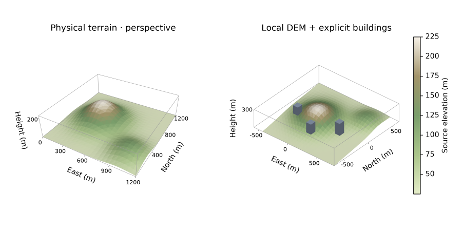

# Galeria 3D original da Azimlib



Relevo e plantas são totalmente sintéticos, definidos em
[examples/terrain3d.py](../../../examples/terrain3d.py).
Sem DEM externo, dados urbanos baixados ou renderer cartográfico de terceiros.
Pillow apenas codifica/compõe pixels; Azimlib calcula câmera, clipping e oclusão.

Reproduzir no ambiente instalado de desenvolvimento:

```bash
python examples/terrain3d.py --output outputs/terrain3d
python examples/terrain3d.py --output outputs/terrain3d --show
```

Os textos, colorbar e eixos são editáveis pela API. SVG/PDF usam a camada de
terreno raster; HTML offline é estático para a câmera. Veja [contrato 3D](../../terrain3d.md).
Inspeção da imagem e provas nativas programáticas Windows não equivalem a
aceite humano Linux/macOS. Nenhuma publicação remota faz parte destas evidências.
