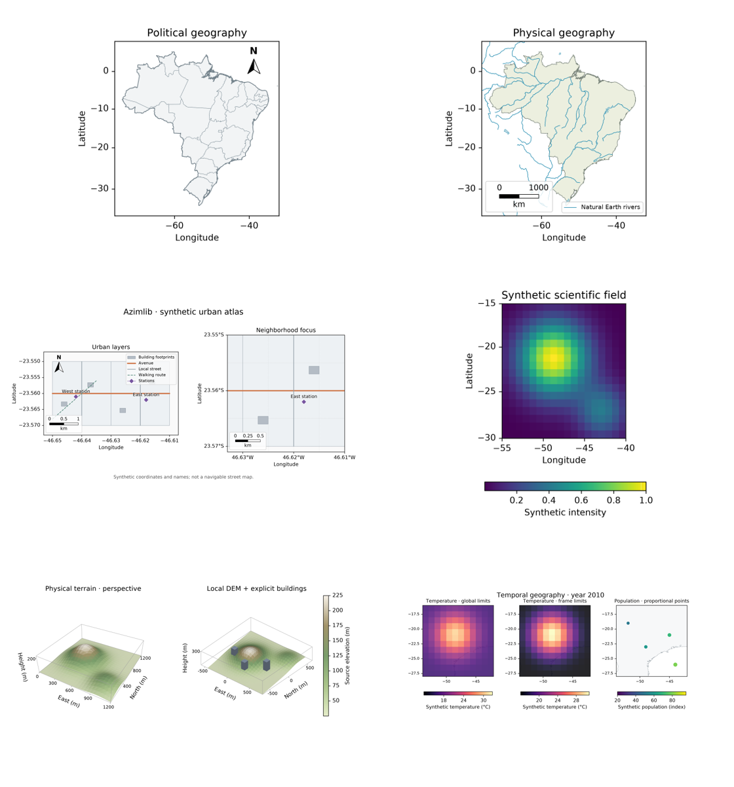

# Integrated 0.3 development gallery

All six compositions below are rendered by Azimlib's own implementations from
`examples/release_atlas.py`. They are **unreleased 0.3.0.dev0 examples**.
[Generation manifest](_static/release030/manifest.json) records exact source,
runtime and export hashes. No Matplotlib images/code are used in this gallery.



| View | Output | Data and guide |
| --- | --- | --- |
| Political Brazil | [PNG](_static/release030/political.png), [SVG](_static/release030/political.svg), [PDF](_static/release030/political.pdf) | Natural Earth public domain; [geodesy](geodesy.md) |
| Physical/hydrographic Brazil | [PNG](_static/release030/physical.png), [SVG](_static/release030/physical.svg), [PDF](_static/release030/physical.pdf) | Natural Earth rivers/lakes/boundaries, not navigation data |
| Synthetic urban atlas | [PNG](_static/release030/urban.png), [SVG](_static/release030/urban.svg), [PDF](_static/release030/urban.pdf) | Original synthetic buildings/streets; [urban](urban.md) |
| Scientific scalar field | [PNG](_static/release030/scientific.png), [SVG](_static/release030/scientific.svg), [PDF](_static/release030/scientific.pdf) | Original formula, CC0 Viridis; [scientific 2D](scientific-2d.md) |
| Physical terrain/extrusion 3D | [PNG](_static/release030/terrain3d.png), [SVG](_static/release030/terrain3d.svg), [PDF](_static/release030/terrain3d.pdf) | Synthetic metric data, own depth raster; [3D](terrain3d.md) |
| Temporal norms/proportional points | [PNG](_static/release030/temporal.png), [SVG](_static/release030/temporal.svg), [PDF](_static/release030/temporal.pdf) | Synthetic data, Natural Earth basemap; [time](temporal.md) |

```bash
python examples/release_atlas.py --output .ci-results/gallery030
```

PNG needs Pillow. All views use bundled DejaVu with its own notice; SVG embeds
fonts and PDF attaches their license. 3D SVG/PDF explicitly contain raster
terrain, not searchable text or pure vector terrain. Layout/numerical bounds and
image tolerances are tested separately from human appearance acceptance.
Original compositions are BSD-3-Clause; datasets/fonts/palettes retain their
own licenses. [Material boundaries](../THIRD_PARTY_LICENSES.md).

See also [scientific maps](scientific-2d.md),
[finishing](_static/finishing/README.md), [3D](_static/terrain3d/README.md)
and [temporal/GIF/atlas](_static/temporal/README.md) collections. Older snapshots
are identified by their recorded runtime hashes; they are not overwritten.
