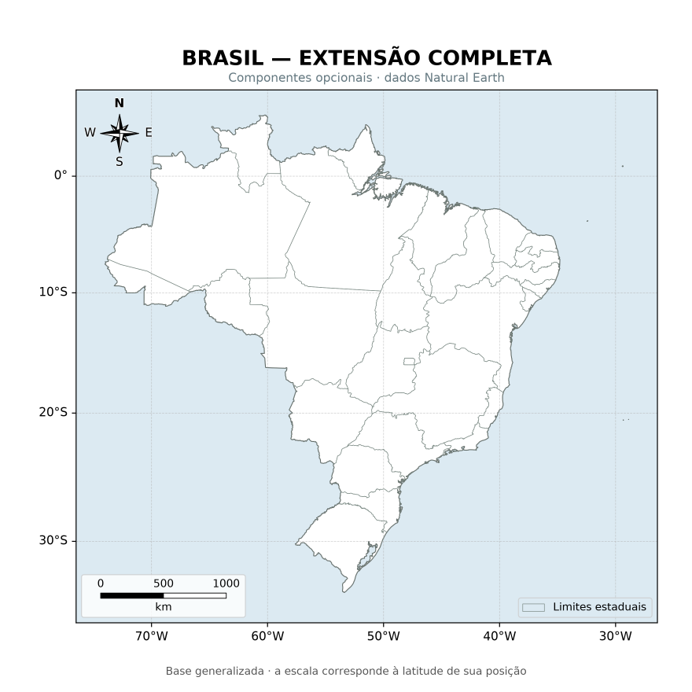
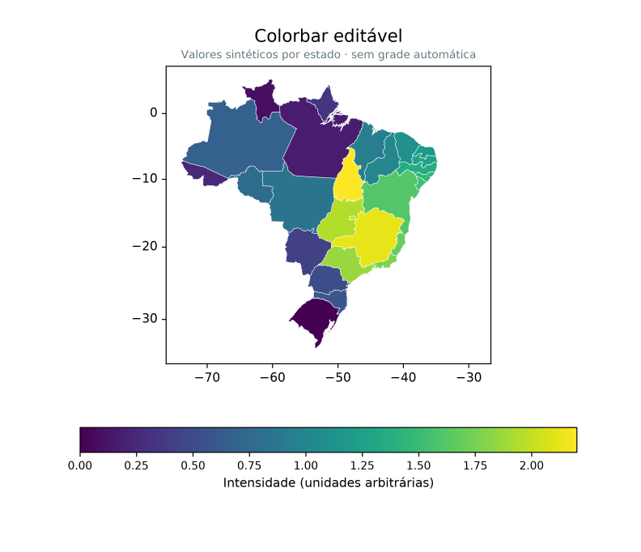
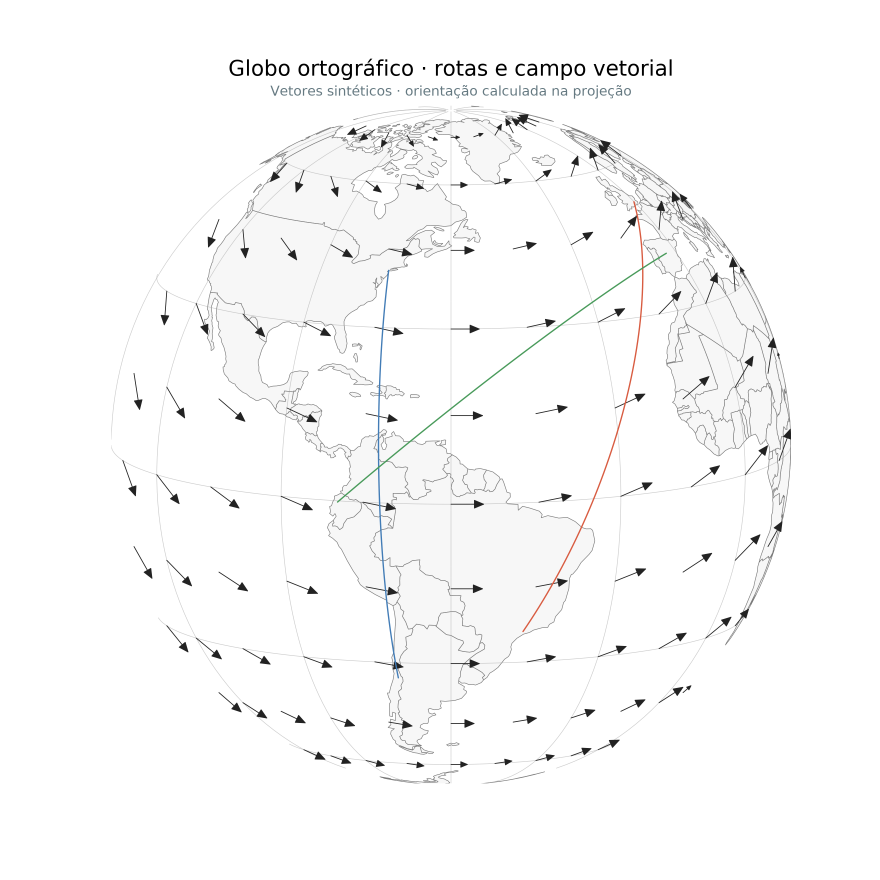
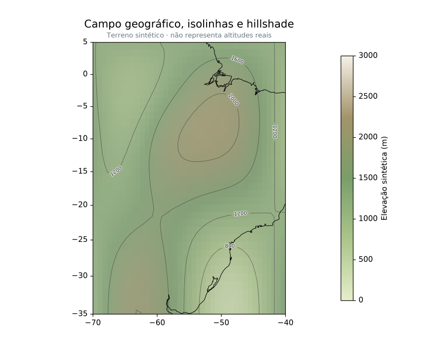

# Maps made with Azimlib

These figures use Azimlib 0.2.0 geometry, composition and PNG rendering.
They are committed so that the README images work in a fresh checkout.
Natural Earth supplies geographic boundaries and rivers; other values are
explicitly synthetic. This is not a map of verified navigation classes or
measured terrain elevation.

## Political map



Country/state boundaries, geographic ticks, legend, scale and orientation.
Source: [regions.py](../examples/regions.py).

## Thematic map and horizontal colorbar



Scalar values per feature, continuous mapping, editable ticks and colorbar.
Source: [scientific.py](../examples/scientific.py), `horizontal_example()`.

## Orthographic globe



An independent spherical projection, graticule, routes and projected vectors.
This is a two-dimensional projection, not a three-dimensional terrain viewer.
Source: [scientific.py](../examples/scientific.py), `globe_example()`.

## Scalar field, hillshade and isolines



Raster field, shading, contours, inline labels, coastline and color scale.
The elevation field is synthetic.
Source: [scientific.py](../examples/scientific.py), `terrain_example()`.

## Reproduce

```bash
python -m pip install -e ".[png]"
python tools/build_readme_showcase.py
```

The builder calls the existing examples and Azimlib's renderer, then assembles
the README overview with Pillow. It does not import Matplotlib. PNG bytes can
vary with dependency/platform versions; [the manifest](_static/showcase/manifest.json)
records the currently committed files, not a guarantee of identical future bytes.
Original composition/code is BSD-3-Clause; [third-party notices](../THIRD_PARTY_LICENSES.md)
retain the separate data, palette and font terms.

The [extended gallery](release-gallery.md) documents more reproducible examples;
its generated local images are not all committed. Run its generator to obtain
the extended PNG/SVG/HTML previews.
