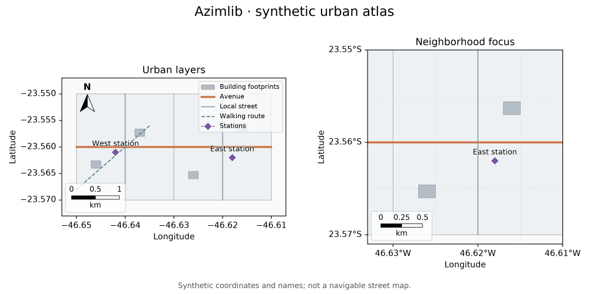

# Mapas urbanos — primeira base da 0.3.0

A branch de desenvolvimento acrescenta entrada CSV, seleção por atributos e
quatro conveniências urbanas. Estes recursos ainda não fazem parte do pacote
0.2.0 publicado. Veja a [checklist da 0.3.0](release-progress-0.3.md).

```python
import azimlib as azl

points = azl.read_csv("stations.csv", longitude="longitude", latitude="latitude",
                      id_column="id", converters={"population": int})
fig, ax = azl.subplots(projection="mercator")
stations = ax.cities(points, marker="o", markersize=6, label="Stations")
ax.labels(stations, field="name", halo="white")
ax.set_title("Stations")
fig.savefig("stations.svg")
```

`import azimlib.pyplot as plt` continua oferecendo a mesma criação de figuras
e o mesmo viewer. A leitura de dados permanece disponível em `azimlib`.

## Dados e contratos

| Método | Geometrias aceitas | Significado |
| --- | --- | --- |
| `ax.cities(data)` | Point, MultiPoint | Centros urbanos ou POIs; não limites municipais |
| `ax.neighborhoods(data)` | Polygon, MultiPolygon | Limites fornecidos de bairros |
| `ax.streets(data)` | LineString, MultiLineString | Traçados de ruas; não grafo de roteamento |
| `ax.buildings(data)` | Polygon, MultiPolygon | Plantas de construções; não extrusões 3D |

Os quatro métodos aceitam os mesmos dados de `geojson()`, `style(feature)`,
`fit`, aliases visuais, `where={"campo": valor}` e `crs` explícito, atualmente
EPSG:4326/3857. Geometrias incompatíveis são rejeitadas antes de alterar limites
ou camadas. Geometrias nulas são preservadas e não desenhadas. Uma seleção vazia
cria uma camada vazia sem mudar a vista. `fit=False` preserva a vista existente.

Linhas, bordas e `markersize` usam **pontos tipográficos**, não metros no solo.
Um atributo `height` não cria volume. Nenhum destes métodos baixa dados, infere
limites a partir de um nome ou acrescenta componentes automaticamente.

## Selecionar e editar

```python
streets = azl.read_geojson("streets.geojson")
avenues = streets.select({"class": "arterial"},
                         predicate=lambda feature: feature.properties.get("lanes", 0) >= 2)
layer = ax.streets(avenues, color="orange", linewidth=2)
layer.set_visible(False)
layer.set(linewidth=1.5, visible=True)
layer.remove()
```

`FeatureCollection.select(where=None, *, predicate=None, geometry_types=None)`
combina os filtros com AND, mantém ordem/IDs e reutiliza as features imutáveis.
Um campo ausente difere de um campo cujo valor é `None`. `geometry_types`
aceita um nome ou iterable de nomes GeoJSON, comparando somente o tipo da
geometria principal. Não é uma operação de interseção espacial.

`read_csv(source, *, longitude="lon", latitude="lat", id_column=None,
converters=None, delimiter=",", encoding="utf-8-sig")` aceita caminhos locais,
texto com quebras de linha, bytes e streams. Streams fornecidos permanecem
abertos. Coordenadas tornam-se floats finitos em graus; latitude deve estar
entre -90 e 90. Outras propriedades permanecem strings, salvo conversores
explícitos. IDs são opcionais; não há inferência de CRS nem de tipos.

Cabeçalhos duplicados/vazios, colunas ausentes, registros malformados,
contagem de campos incorreta e dados inválidos falham com erro. Registros
inválidos nunca são descartados silenciosamente. Linhas físicas vazias são
ignoradas, como linhas sem registros; erros de registros incluem o número da
linha física. CSV vazio não representa uma coleção; cabeçalho válido sem
registros representa uma coleção vazia.

## Exemplo reproduzível e proveniência



[examples/urban.py](../examples/urban.py) constrói bairros, ruas, edifícios e
estações **inteiramente sintéticos**, com legenda, rótulos com halo, norte,
escala e dois mapas. Não contém dados OSM, endereços ou pessoas reais.

```bash
python examples/urban.py --output gallery/urban
```

Exporta PNG/SVG com o renderer próprio. Grid, legenda, norte, escala e
minimapa continuam opcionais. Layers podem ser editadas, ocultadas e removidas
com o mesmo ciclo de Artists do núcleo existente.

Dados reais posteriores precisam de origem, versão, licença e atribuições
explícitas. O leitor OSM planejado não torna bases ODbL propriedade da Azimlib;
exemplos e pacotes de dados terão seus próprios avisos. Leitores adicionais,
largura geográfica, indexação densa e picking constam na checklist, ainda
pendentes. Geocodificação e roteamento não estão implementados neste lote.
