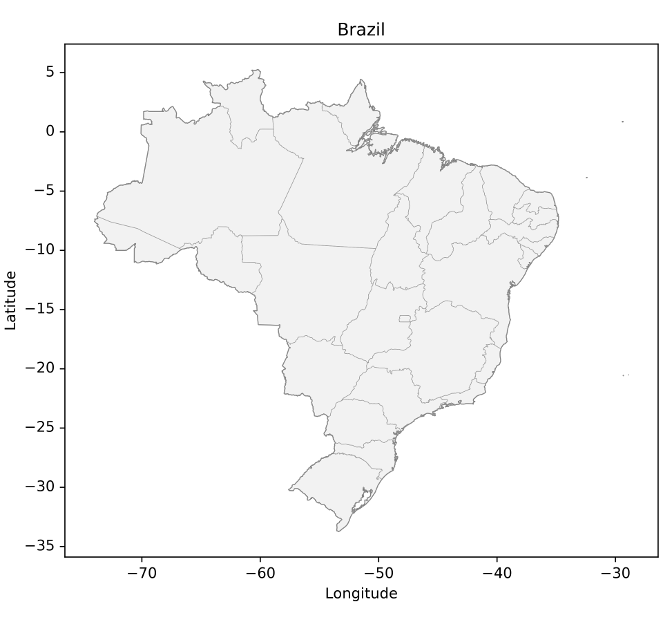
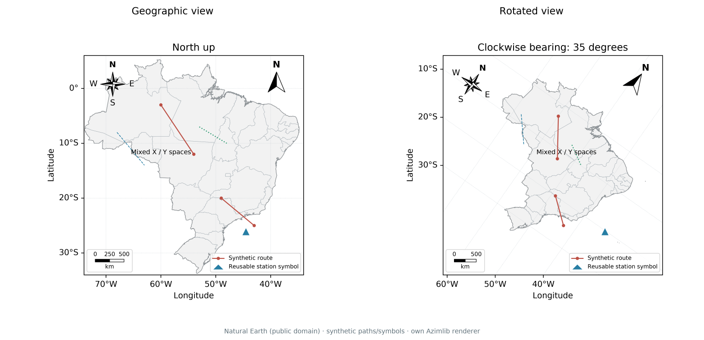

# Recommended clean view

The default light style gives a white figure, a plain axes frame, standard
typography and physical line widths. Add only the content the map needs:

```python
import azimlib as azl
# Equivalent convenience import: import azimlib.pyplot as plt

with azl.style.context('default'):
    fig, ax = azl.subplots(figsize=(6.4, 6), layout='constrained')
    ax.map('brazil', facecolor='#f2f2f2', edgecolor='#444444', linewidth=0.6)
    ax.states(edgecolor='#999999', linewidth=0.35)
    ax.set_title('Brazil')
    ax.set_xlabel('Longitude')
    ax.set_ylabel('Latitude')

fig.savefig('brazil.svg')
fig.savefig('brazil.png', dpi=200)
azl.show()
```



Grid, legend, colorbar, scale, north arrow, compass and overview are optional.
No minimap, grid or cartographic ornament is added by default. Components
retain independent `set_visible`, `set_in_layout`, editing and removal controls.
Prefer thin boundaries and one strong accent for thematic information. Use
larger DPI for PNG delivery; changing DPI does not change the physical widths
or font sizes. `savefig()` contains no UI; `show()` adds viewer controls outside
the map. The [runnable example](../examples/clean_map.py) exports PNG/SVG/HTML.

## Rotation in 0.3 development

```python
ax.set_bearing(35)              # clockwise display rotation, degrees
north = ax.north_arrow()        # optional, independent
rose = ax.compass()             # optional, independent
angle = north.get_angle()       # local north, clockwise from display-up
```

Bearing starts at zero and is normalized modulo 360. Coordinates and CRS stay
geographic; rotation is in the projected viewport, with isotropic scaling.
Both indicators follow the local projected direction of north at their own
anchors. In curved projections their angles may differ because local north
differs by position. Cardinal labels remain upright for readability. A finite
northward derivative is used; at a pole or outside the inverse domain the
indicator falls back to the bearing. This is map rotation, not a 3D camera.
The compass never replaces the north arrow.

PNG/SVG and the Python desktop renderer recompose the rotated map. Navigation
history retains bearing and projection. Standalone HTML exports the rotated
scene but uses its existing snapshot navigation fallback for rotated/curved
views: it cannot execute Python or recompute arbitrary graticules/ornaments.
Use Python and `savefig()` for a final recomposed output. A live portable
bridge is still [step 7.03](release-progress-0.3.md).



The [atlas example](../examples/composition_atlas.py) uses Natural Earth
boundaries (public domain), synthetic routes and an original triangle symbol.
See [composition contracts](transforms-composition.md) and [asset provenance](_static/composition/README.md).
